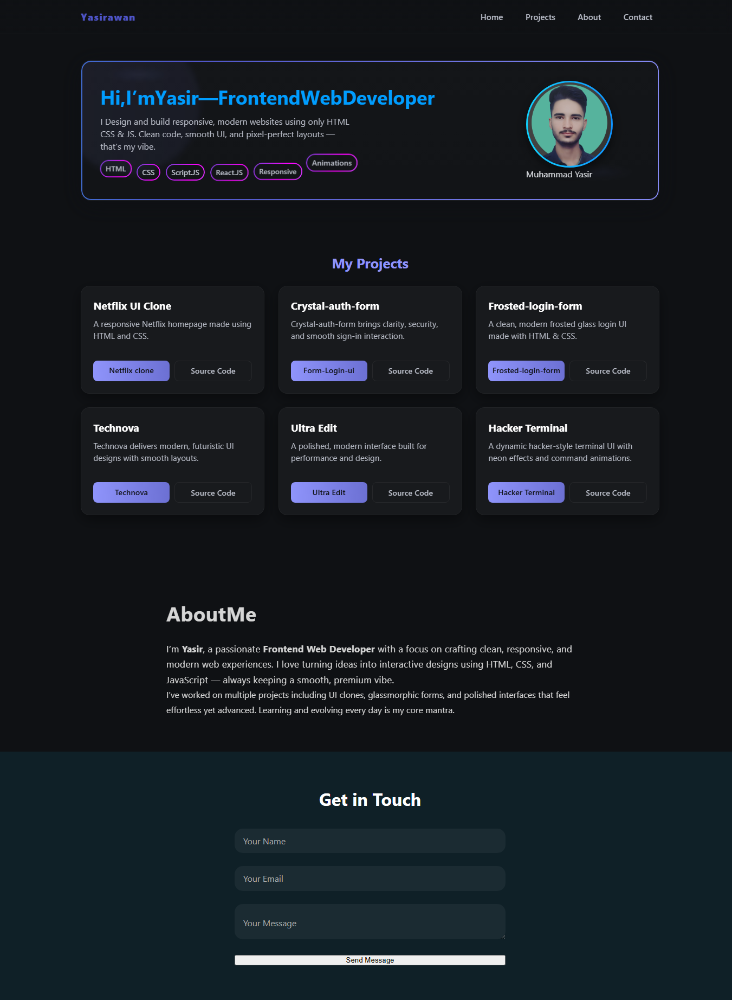

# 👋 Hey, I'm Yasir Fronted Web Dev

A sleek and modern portfolio crafted with a refined aesthetic and sharp attention to detail.
Built to highlight my work, personality, and technical craft — all wrapped in a clean, high-end visual experience.
Smooth animations, balanced spacing, and an overall vibe that feels polished and intentional.

## 🌟 Core Highlights

Minimal & Lux UI — soft edges, clean spacing, and a premium feel

Smooth Interactions — subtle transitions that make the site feel alive

Fully Responsive — optimized for every device with consistent aesthetics

Lightweight Build — fast performance without unnecessary clutter

Professional Structure — clean code, organized assets, easy scalability

🛠️ Stack & Techniques

HTML5 (semantic structure)

CSS3 (grid, flexbox, modern animation techniques)

JavaScript (smooth interactions + UI behavior)

Responsive Design

## 📸 Showcase Preview



## 📁 Project Layout

│index.html
│ style.css
│ script.js
│ assets/
│images
│ icons
│ screenshots

## 📂 How to Use

1. Clone this repository:
   ```bash
   git clone https://github.com/YasirAwaan/portfolio.git
   ```

---

🚀 Launch

Instant load. Instant experience.

💼 About This Portfolio

This portfolio is a curated space that reflects my style as a developer — clean structure, calm aesthetics, and thoughtful details.
Everything here is built with purpose: smooth flow, modern visuals, and a layout that feels balanced and intentional.
It represents how I work, how I design, and how I like my projects to speak for themselves: simple, elegant, and undeniably professional.

## 📫 Connect With Me

- **GitHub:** https://github.com/YasirAwaan
- **Email:** yasirawan2847@gmail.com
- **LinkedIn:** (http://www.linkedin.com/in/yasir-awaan)

For collaborations, freelance work, or ideas — feel free to reach out.

✨ _"Code. Create. Inspire."_ ✨
